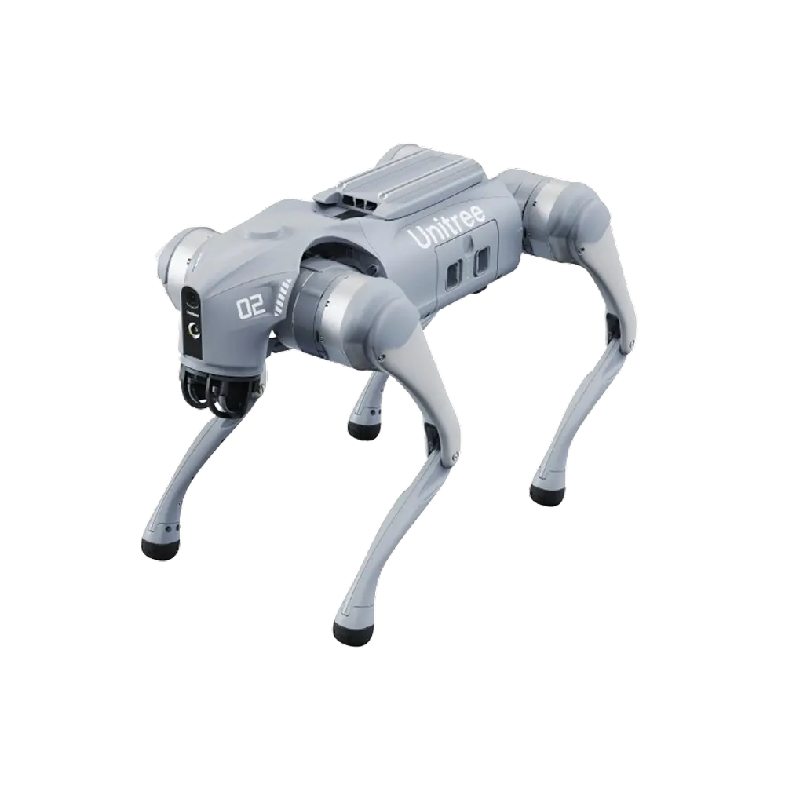

The Vehicle Industry Research Center operates multiple laboratories, both at the ZalaZONE facility and on our Győr campus.

## Battery and Electronics Test Laboratory
| Laboratory ID | L2/K4 |
| --- | --- |
| Location | Győr, Campus (Hungary) |

**Climate-Controlled Battery Testing Environment**

Our laboratory is equipped with a high-performance dynamic climate chamber (Binder LIT-MK 720), enabling precise thermal control for battery measurements under varying environmental conditions. The chamber offers a wide temperature range from -40C° to +110C°, allowing for comprehensive thermal profiling of cells and packs. For enhanced operational safety during battery testing, the system features the P Plus safety package, suitable for tests up to EUCAR hazard level 5. Additional safety measures include an inert gas connection and a fully automatic CO₂ fire extinguishing system, making the chamber ideal for both development and safety validation of lithium-ion battery systems. 

**Battery Measurement and Emulation Systems**

The laboratory features an advanced NHR9200 modular measurement and emulation system designed for high precision battery testing. This bidirectional power system supports power levels from up to 24 kW and operates  within a voltage range of 5–120 V. The system includes a regenerative discharge option for energy-efficient operation. It is integrated within a National Instruments-based measurement environment, enabling complex test automation and real-time data acquisition. The setup supports a wide range of test applications including cyclic measurements, performance benchmarking, and in-depth battery characterization, making it a versatile tool for both research and industrial applications.  

**Additional Infrastructure and Safety Systems**

Complementing the core systems, our lab includes multiple 5 kW EA power supplies and electronic loads, a Gamry electrochemical impedance spectroscopy (EIS) measurement unit, and a custom NI CompactRIO-based system. This measurement system enables up to 16 channels of active cell balancing and 24 channels of cell voltage and temperature monitoring, supporting both cell-level and pack level measurements up to 60 V and 200 A. For storage and charging safety, we utilize Düperthal Battery Standard XL safety cabinets, which offer 90 minutes of fire resistance and comply with DIN EN 14470-1 and DIN EN 14727. These cabinets feature automatic fire responsive door closures, fire escape locks, and exhaust connections. Additionally, for safe battery handling and transport, the lab is equipped with a fire extinguisher system specifically designed for lithium battery applications.

{: style="height:300px"}

## Electric Powertrain Testbench

| Laboratory ID | L2/K5 |
| --- | --- |
| Location | Győr, Campus (Hungary) |

In the Electric Powertrain Testbench Laboratory is able to test electrical machines on different power levels. The high-performance testbench can currently be tested with a measuring range of 250 Nm and 4000 rpm (by brake machine, but this range can be modified with a gearbox). On the low-power testbench can perform drive tests up to 5 kW in the range of 100 Nm and 800 rpm. It is also possible to perform other task-dependent tests on the own developed testbench systems.

Link: [szolgaltatas.sze.hu/en_GB/electric-powertrain-testbench](https://szolgaltatas.sze.hu/en_GB/electric-powertrain-testbench)

{: style="height:300px"}

## Robotics Laboratory
| Laboratory ID | L1/101 |
| --- | --- |
| Location | Győr, Campus (Hungary) |

The Robotics Laboratory is equipped with a variety of robotic platforms, including the Unitree Go2 Edu quadruped robot, which serves as a versatile tool for research and development in robotics. The lab provides an environment for testing and developing algorithms related to perception, navigation, and control. It is also equipped with various sensors and computing resources to support advanced robotics research. The lab's infrastructure allows for the integration of different robotic systems and the development of custom solutions for specific research challenges.

{: style="height:300px"}
{: style="height:300px"}

## Calibration and Diagnostics Laboratory
| Laboratory ID | ZIP Lab4 |
| --- | --- |
| Location | ZalaZONE (Hungary) |

The basic function of the lab is to perform various vehicle-level sensor calibration and diagnostic tasks. In addition to basic measuring and diagnostic tools, the workshop is equipped with electronics and 3D printing workstations, which are essential for assembling the necessary measuring systems and manufacturing custom parts/prototypes. Autonomous test vehicles can be prepared here for test track measurements.