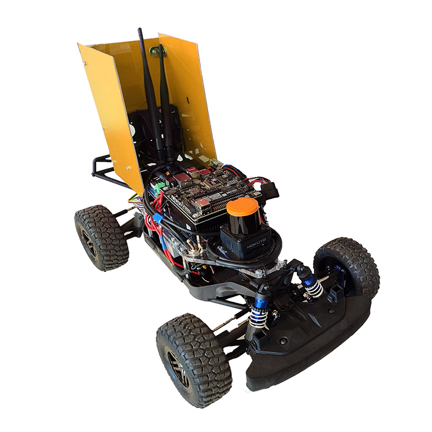

---
hide:
  - navigation
---

## About F1/10 Autonomous Racing

F1TENTH (F1/10) Autonomous Racing is a semi-regular competition organized by an international community of researchers, engineers, and autonomous systems enthusiasts. The teams participating in an F1TENTH compatition will build a 1:10 scaled autonomous race car according to a given specification and write software for it to fulfill the objectives for the competition: Don’t crash and minimize laptime.

<figure markdown="span">
  { width="400" }
  <figcaption>F1TENTH car</figcaption>
</figure>

## About SMT 2025

The 2nd Sustainable Mobility and Transportation Symposium, an interdisciplinary scientific conference organized by the Audi Hungaria Faculty of Vehicle Engineering and the Vehicle Industry Reserach Center of Széchenyi István University. The conference is dedicated to exploring the latest advancements and innovations in the field of automotive technology and transportation, and aims to bring together experts from various domains to foster collaboration, share insights, and shape the future of mobility. 

## Official Websites

- [smtsymposium.sze.hu](https://smtsymposium.sze.hu/)
- [roboracer.ai](https://roboracer.ai/race.html)

# F1/10 @SMT2025

## Imortant Dates

- **Competition date**: october 2025 *(TODO: exact date to be announced)*
- **Registration opens**: *(TODO: exact date to be announced)*
- **Registration deadline**: *(TODO: exact date to be announced)*

## Place

Europe, Hungary, Győr, Széchenyi István University

<iframe src="https://www.google.com/maps/embed?pb=!1m18!1m12!1m3!1d2685.527007465113!2d17.626114976271186!3d47.69360507119796!2m3!1f0!2f0!3f0!3m2!1i1024!2i768!4f13.1!3m3!1m2!1s0x476bbfde2b86b24d%3A0xb0b816da0af54c2c!2sVehicle%20Industry%20Research%20Center!5e0!3m2!1sen!2shu!4v1732101780142!5m2!1sen!2shu" width="600" height="450" style="border:0;" allowfullscreen="" loading="lazy" referrerpolicy="no-referrer-when-downgrade"></iframe>

## Race Resources

All necessary information about the race e.g. rules, scoring system, simulation environments and track data will be displayed here.

- Rules
- Frequently Asked Questions
- In-person competition

# Flyer

