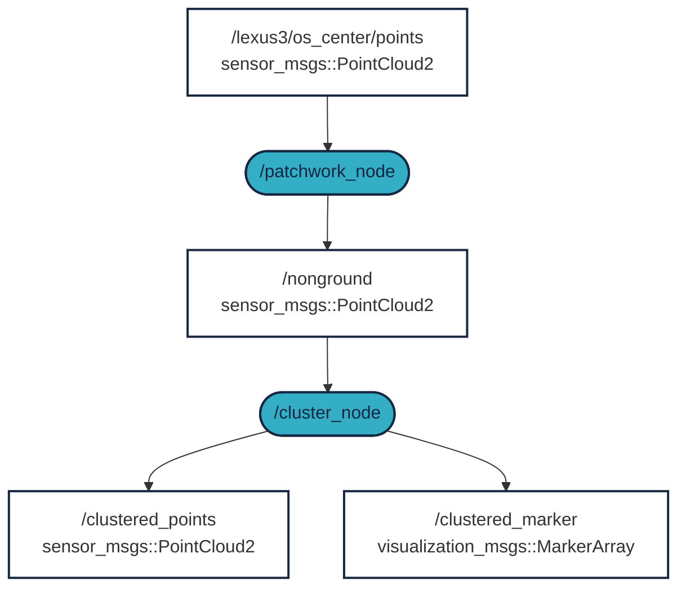

# Workshop on ROS 2 LIDAR clustering

This short workshop will guide you how to filter and cluster LIDAR data into objets. Objects in our case are pedestrians, cars, buildings and so on. The workshop is ROS 2 compatible [](https://docs.ros.org/en/humble/)

## Requirements (high-level overview)
1. ROS 2 Humble: 🟠 see previous workshops or [docs.ros.org/en/humble/Installation.html](https://docs.ros.org/en/humble/Installation.html) 
2. A log file with raw LIDAR data (MCAP format) ✅ 
3. Filtering out the ground plane with `patchworkpp` ✅ 
4. Clustering the non-grund data into objects with `lidar_cluster` ✅ 


## Video overview

In the following a screen record of the steps are presented:

<iframe width="560" height="315" src="https://www.youtube.com/embed/YJyczb53vrg?si=rqnKHgE7y70-5B3a" title="YouTube video player" frameborder="0" allow="accelerometer; autoplay; clipboard-write; encrypted-media; gyroscope; picture-in-picture; web-share" referrerpolicy="strict-origin-when-cross-origin" allowfullscreen></iframe>


## `Step 1.` - Download the raw data

In order to cluster LIDAR data, first you need - no surprise - LIDAR data. Use any of the following 3 option.

### `Option A.` - Download our MCAP from a link 

[Download MCAP [~540MB] :material-download: ](https://laesze-my.sharepoint.com/:u:/g/personal/herno_o365_sze_hu/Eclwzn42FS9GunGay5LPq-EBA6U1dZseBFNDrr6P0MwB2w?download=1){ .md-button }

In our case `/mnt/c/bag/` is used as the `.mcap` folder, if you use other, modify it when executing the following steps.

### `Option B.` - Download our MCAP as a terminal command

<details>
<summary> Don't forget to change directory first.</summary>

In our case /mnt/c/bag/ is used as a final destination:

``` bash
cd /mnt/c/bag/
```
</details>

```
wget https://laesze-my.sharepoint.com/:u:/g/personal/herno_o365_sze_hu/Eclwzn42FS9GunGay5LPq-EBA6U1dZseBFNDrr6P0MwB2w?download=1  -O lexus3-2024-04-05-gyor.mcap
```


### `Option C.` - Use own MCAP
You can use your own MCAP, please note that you have to change following:

- LIDAR topic which is on our case `/lexus3/os_center/points` and the 
- LIDAR frame (in our case: `lexus3/os_center_a_laser_data_frame`) 

In the following steps based on your own data, topic and frame must be set.

### Check your raw data

Play your bag e.g. with:
``` bash
ros2 bag play /mnt/c/bag/lexus3-2024-04-05-gyor.mcap -l
```

!!! info 
    In the `play` command `-l` means to loop the mcap file.

!!! success
    If everything works as expected you shold see a bunch of topics in another terminal
    <details>
    <summary> Topics</summary>
    In another terminal issue the command:

    ``` bash
    ros2 topic list
    ```
    You sholud see a similar list opf topics:

    ``` bash
    /clock
    /events/read_split
    /lexus3/gps/duro/current_pose
    /lexus3/gps/duro/imu
    /lexus3/gps/duro/mag
    /lexus3/gps/duro/navsatfix
    /lexus3/gps/duro/status_flag
    /lexus3/gps/duro/status_string
    /lexus3/gps/duro/time_diff
    /lexus3/gps/duro/time_ref
    /lexus3/os_center/points
    /lexus3/os_left/points
    /lexus3/os_right/points
    /lexus3/zed2i/zed_node/left/image_rect_color/compressed
    /parameter_events
    /rosout
    /tf
    /tf_static   
    ```
    </details>

    Also there must be at least a `sensor_msgs/msg/PointCloud2`, chechk with:
    ``` bash
     ros2 topic type /lexus3/os_center/points
    ```
    Result:
    ``` bash
    sensor_msgs/msg/PointCloud2
    ```

## `Step 2.` - Install `ROS 2` packages

!!! info 
    If you don't have ` ~/ros2_ws/` directory, use your own workspace, or create it:
    ```bash
    mkdir -p ~/ros2_ws/src
    ```

### Clone `patchworkpp` package
`patchwork-plusplus-ros` is ROS 2 package of Patchwork++ (@ IROS'22), which provides fast and robust LIDAR ground segmentation. This package is developed by [KAIST](https://github.com/url-kaist/) (Korea Advanced Institute of Science & Technology), but you can use the [JKK research](https://github.com/jkk-research/) fork too.

```bash
cd ~/ros2_ws/src
```

```bash
git clone https://github.com/jkk-research/patchwork-plusplus-ros
```

Alternatively you can download the `ROS2` branch from KAIST:

```bash
git clone https://github.com/url-kaist/patchwork-plusplus-ros -b ROS2
```

### Clone `lidar_cluster` package

```bash
cd ~/ros2_ws/src
```

``` bash
git clone https://github.com/jkk-research/lidar_cluster_ros2
```


### Build the packages

```bash
cd ~/ros2_ws
```

```bash
colcon build --packages-select patchworkpp lidar_cluster --symlink-install
```


## `Step 3.` - Run


### What to expect



<details>
<summary> Don't forget to source before ROS commands.</summary>

``` bash
source ~/ros2_ws/install/setup.bash
```
</details>

```bash
ros2 bag play /mnt/c/bag/lexus3-2024-04-05-gyor.mcap -l
```

```bash
ros2 launch patchworkpp demo.launch.py  cloud_topic:=/lexus3/os_center/points cloud_frame:=lexus3/os_center_a_laser_data_frame
```
Use an example clustering algorithm (`version 1.`):

```bash
ros2 launch lidar_cluster dbscan_spatial.launch.py
```

Alternatively use an example clustering algorithm (`version 2.`):
```bash
ros2 launch lidar_cluster euclidean_spatial.launch.py
```

Alternatively use an example clustering algorithm (`version 3.`):
```bash
ros2 launch lidar_cluster euclidean_grid.launch.py
```

```bash
ros2 launch lidar_cluster rviz02.launch.py
```

!!! success
    If everything works as expected you should see a similar rviz window. 
    