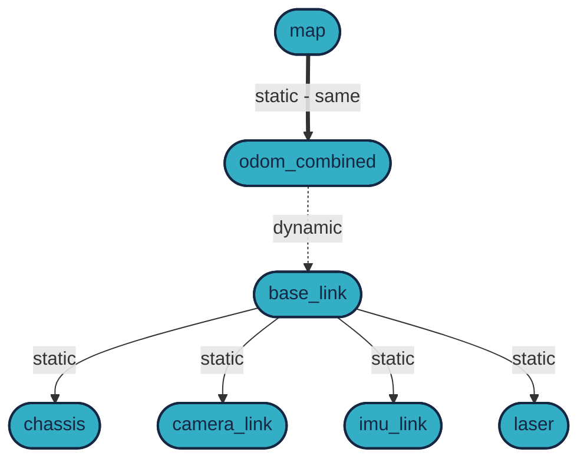

# `ROS 2` F1/10 Wheeltec Gazebo simulation workshop

The workshop is ROS 2 compatible [](https://docs.ros.org/en/humble/) and [](https://docs.ros.org/en/jazzy/)

## Video

Part 1 of the video series about the workshop is available on YouTube:

<iframe width="560" height="315" src="https://www.youtube.com/embed/90cVRC2Hd7Y?si=GUiIyuXk71Bu1uGd" title="YouTube video player" frameborder="0" allow="accelerometer; autoplay; clipboard-write; encrypted-media; gyroscope; picture-in-picture; web-share" referrerpolicy="strict-origin-when-cross-origin" allowfullscreen></iframe>

Part 2 of the video:

<iframe width="560" height="315" src="https://www.youtube.com/embed/ZlNOnPJfS9c?si=Cj6xaboiXv5sCHvL" title="YouTube video player" frameborder="0" allow="accelerometer; autoplay; clipboard-write; encrypted-media; gyroscope; picture-in-picture; web-share" referrerpolicy="strict-origin-when-cross-origin" allowfullscreen></iframe>

## Requirements (high-level)
1. ROS 2 Humble: 🟠 see previous workshops or [docs.ros.org/en/humble/Installation.html](https://docs.ros.org/en/humble/Installation.html) 
2. Gazebo Fortress: ✅ current workshop [gazebosim.org/docs/fortress/install_ubuntu](https://gazebosim.org/docs/fortress/install_ubuntu)
3. `ROS gz bridge`:  ✅ current workshop, ROS integration. Install with a single command: `sudo apt install ros-humble-ros-gz-bridge`, [gazebosim.org/docs/fortress/ros2_integration](https://gazebosim.org/docs/fortress/ros2_integration)
4. Build and run custom worlds and models  ✅ current workshop (e.g. `F1/10` / `Wheeltec, Roboworks`) 

<figure markdown="span">
  { width="80%" }
  <figcaption>Official F1/10 vehicle vs Wheeltec Roboworks Ackermann Rosbot mini vehicle</figcaption>
</figure>

## Binary Installation on Ubuntu

Fortress binaries are provided for Ubuntu Bionic, Focal and Jammy. All of the Fortress
binaries are hosted in the osrfoundation repository. To install all of them,
the metapackage `ignition-fortress` can be installed. The following is based on [gazebosim.org/docs/fortress/install_ubuntu](https://gazebosim.org/docs/fortress/install_ubuntu).

First install some necessary tools:

```bash
sudo apt-get update
```
```bash
sudo apt-get install lsb-release wget gnupg
```

Then install Ignition Fortress:


```bash
sudo wget https://packages.osrfoundation.org/gazebo.gpg -O /usr/share/keyrings/pkgs-osrf-archive-keyring.gpg
```
```bash
echo "deb [arch=$(dpkg --print-architecture) signed-by=/usr/share/keyrings/pkgs-osrf-archive-keyring.gpg] http://packages.osrfoundation.org/gazebo/ubuntu-stable $(lsb_release -cs) main" | sudo tee /etc/apt/sources.list.d/gazebo-stable.list > /dev/null
```
```bash
sudo apt-get update
```
```bash
sudo apt-get install ignition-fortress
```

All libraries should be ready to use and the `ign gazebo` app ready to be executed.

## Gazebo Fortress ROS 2 integration

Issue the following command:


=== "Humble"

    ```bash
    sudo apt install ros-humble-ros-gz-bridge
    ```

=== "Jazzy"

    ```bash
    sudo apt install ros-$ROS_DISTRO-ros-gz-bridge
    ```
    
## Additional settings to WSL2

!!! danger "Warning - WSL2"

    There is an [issue](https://github.com/gazebosim/gz-sim/issues/1841), which can be set even in `~/.bashrc`:

```bash
export LIBGL_ALWAYS_SOFTWARE=1
```

Set it in `~/.bashrc`:
```bash
echo "export LIBGL_ALWAYS_SOFTWARE=1" >> ~/.bashrc
```

<details>
<summary> Don't forget to source bashrc.</summary>

``` bash
source ~/.bashrc
```
</details>

After new terminal or `source`:

```bash
echo $LIBGL_ALWAYS_SOFTWARE
```

should  print `1`. Alternatively 


```bash
cat ~/.bashrc | grep LIBGL
```
should print the line.

## Optional: Install `rviz-2d-overlay` plugin

For better visualization (rviz top left corner yellow text), install the `rviz-2d-overlay` plugin:

=== "Humble"

    ```bash
    sudo apt install ros-humble-rviz-2d-overlay*
    ```

=== "Jazzy"

    ```bash
    sudo apt install ros-$ROS_DISTRO-rviz-2d-overlay*
    ```


## Check the installation


!!! success 

    Now the `ign gazebo` should work and the `ros2` commands should be available.


Try at least one of the following commands:

```bash
ign gazebo
```

```bash
ign gazebo -v 4 -r ackermann_steering.sdf
```

```bash
ign gazebo shapes.sdf
```


```bash
ign param --versions
```


## Packages and build

Detailed description of the packages and build process.

It is assumed that the workspace is `~/ros2_ws/`.

The `robotverseny_gazebo24` package contains the Gazebo 2.4 world and model files for the Wheeltec Roboworks robot, while the `megoldas_sim24` package contains simple controllers to drive the robot in the simulation.


``` bash
cd ~/ros2_ws/src
```

``` bash
git clone https://github.com/robotverseny/robotverseny_gazebo24
```

``` bash
git clone https://github.com/robotverseny/megoldas_sim24
```


## Build

Build the following packages:

- `robotverseny_application`
- `robotverseny_description`
- `robotverseny_bringup`
- `robotverseny_gazebo`
- `megoldas_sim24`

``` bash
cd ~/ros2_ws
```

``` bash
colcon build --symlink-install --packages-select robotverseny_application robotverseny_description robotverseny_bringup robotverseny_gazebo megoldas_sim24
```


## Run the simulation

<details>
<summary> Don't forget to source before ROS commands.</summary>

``` bash
source ~/ros2_ws/install/setup.bash
```
</details>

``` bash
ros2 launch robotverseny_bringup roboworks.launch.py
```

## Run the controllers

After starting the simulation, we will need a controller to drive the robot. Two simple controllers are provided: `simple_pursuit.py` and `follow_the_gap.py`. An image of the simulation with follow_the_gap controller is shown below.


In a new terminal:

<details>
<summary> Don't forget to source before ROS commands.</summary>

``` bash
source ~/ros2_ws/install/setup.bash
```
</details>

```bash
ros2 launch megoldas_sim24 megoldas1.launch.py # start simple_pursuit
```
```bash
ros2 run megoldas_sim24 simple_pursuit.py
```
```bash
ros2 launch megoldas_sim24 megoldas2.launch.py # start follow_the_gap
```
```bash
ros2 run megoldas_sim24 follow_the_gap.py
```

- [simple_pursuit](https://github.com/robotverseny/megoldas_sim24/blob/main/megoldas_sim24/simple_pursuit.py)
- [follow_the_gap](https://github.com/robotverseny/megoldas_sim24/blob/main/megoldas_sim24/follow_the_gap.py)
- [megoldas1.launch.py](https://github.com/robotverseny/megoldas_sim24/blob/main/launch/megoldas1.launch.py)
- [megoldas2.launch.py](https://github.com/robotverseny/megoldas_sim24/blob/main/launch/megoldas2.launch.py)

The results can be seen in the animation below:


## Useful commands

Publish command topic:
``` bash
ros2 topic pub --once /roboworks/cmd_vel geometry_msgs/msg/Twist "{linear: {x: 2.5, y: 0.0, z: 0.0}, angular: {x: 0.0, y: 0.0, z: -0.01}}"
```

Teleop twist keyboard:
``` bash
ros2 run teleop_twist_keyboard teleop_twist_keyboard --ros-args -r /cmd_vel:=/roboworks/cmd_vel
```
    
Ignition info topic:
``` bash
ign topic -i --topic /model/roboworks/cmd_vel
```
Ignition echo topic:

``` bash
ign topic -et /model/roboworks/cmd_vel
```

Topics:

``` bash
ros2 topic list
```
<details>
<summary> Here are the topics.</summary>

``` bash
/clicked_point
/clock
/goal_pose
/initialpose
/joint_states
/parameter_events
/robot_description
/roboworks/cmd_vel
/roboworks/odometry
/roboworks/scan
/rosout
/tf
/tf_static
```
</details>


## Transformations

The frame `/odom_combined` is practically the same as `/map`, there is a static `0,0,0` transform between them. The only dynamic transform is between `/odom_combined` and `/base_link`.



You can visualize the frames with:

``` bash
ros2 run rqt_tf_tree rqt_tf_tree
```

!!! danger

    There might be even more frames, but we are not using them.

## Performance troubleshooting

If the simulation is slow, try the following:

Add `--cmake-args -DCMAKE_BUILD_TYPE=Release` to the build command. And or adjust `--parallel-workers N` to the number of CPU cores. Example: 

``` bash
colcon build --symlink-install --cmake-args -DCMAKE_BUILD_TYPE=Release --parallel-workers 4 --packages-select robotverseny_application robotverseny_description robotverseny_bringup robotverseny_gazebo megoldas_sim24
```

As suggested by [DDS settings for ROS 2 and Autoware](https://autowarefoundation.github.io/autoware-documentation/main/installation/additional-settings-for-developers/network-configuration/dds-settings/): set the config file path and enlarge the Linux kernel maximum buffer size.

``` bash
# Increase the maximum receive buffer size for network packets
sudo sysctl -w net.core.rmem_max=2147483647  # 2 GiB, default is 208 KiB

# IP fragmentation settings
sudo sysctl -w net.ipv4.ipfrag_time=3  # in seconds, default is 30 s
sudo sysctl -w net.ipv4.ipfrag_high_thresh=134217728  # 128 MiB
```

To make it permanent,

``` bash
sudo nano /etc/sysctl.d/10-cyclone-max.conf
```

Paste the following into the file:
``` bash
# Increase the maximum receive buffer size for network packets
net.core.rmem_max=2147483647  # 2 GiB, default is 208 KiB

# IP fragmentation settings
net.ipv4.ipfrag_time=3  # in seconds, default is 30 s
net.ipv4.ipfrag_high_thresh=134217728  # 128 MiB, default is 256 KiB
```
Save and exit (`CTRL+O`, `ENTER`, `CTRL+X`).

Also have a look at [Network settings for ROS 2 and Autoware](https://autowarefoundation.github.io/autoware-documentation/main/installation/additional-settings-for-developers/network-configuration/) and [Performance Troubleshooting](https://autowarefoundation.github.io/autoware-documentation/main/support/troubleshooting/performance-troubleshooting/)

## Additional resources

- [github.com/robotverseny](https://github.com/robotverseny)
- [github.com/robotverseny/robotverseny_gazebo24](https://github.com/robotverseny/robotverseny_gazebo24)
- [github.com/robotverseny/megoldas_sim24](https://github.com/robotverseny/megoldas_sim24)
- [robotverseny.github.io](https://robotverseny.github.io)
- [sze-info.github.io/ajr/szimulacio/f1tenth_sim_a](https://sze-info.github.io/ajr/szimulacio/f1tenth_sim_a/)
- [autowarefoundation.github.io/autoware-documentation/main/support/troubleshooting/performance-troubleshooting](https://autowarefoundation.github.io/autoware-documentation/main/support/troubleshooting/performance-troubleshooting/)