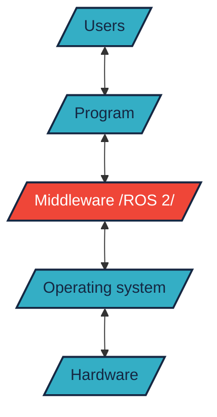
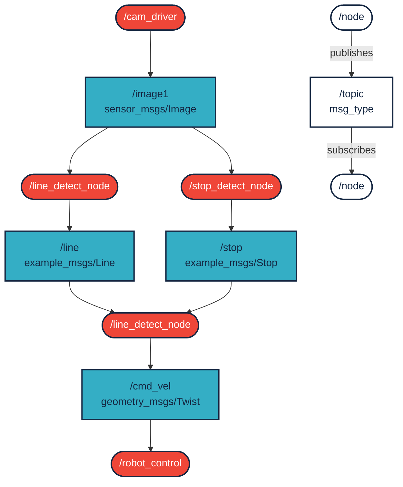
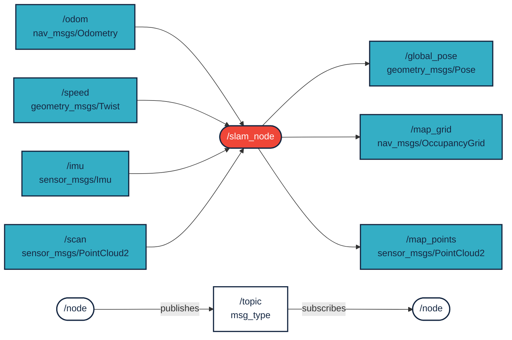
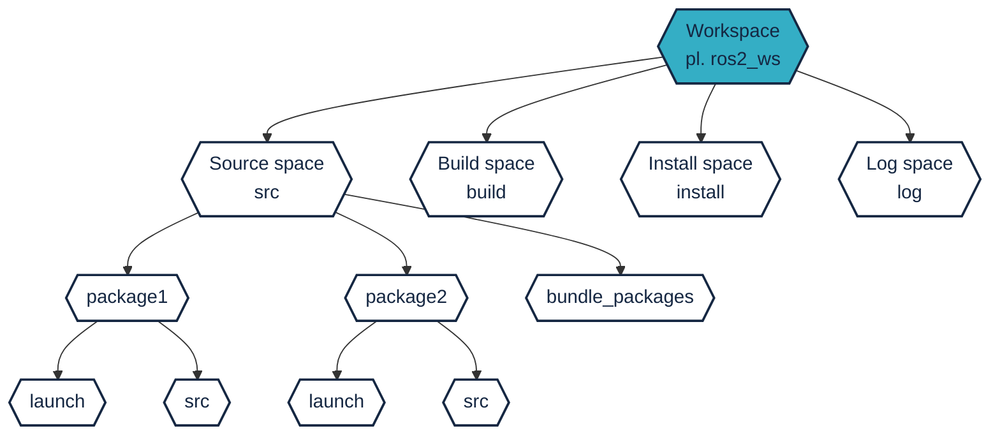
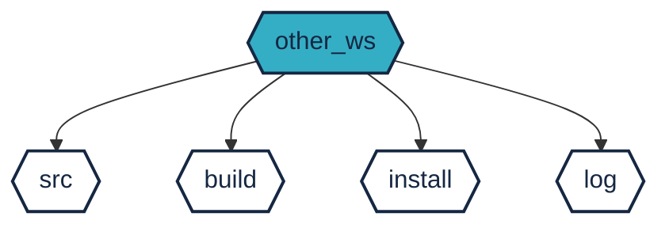
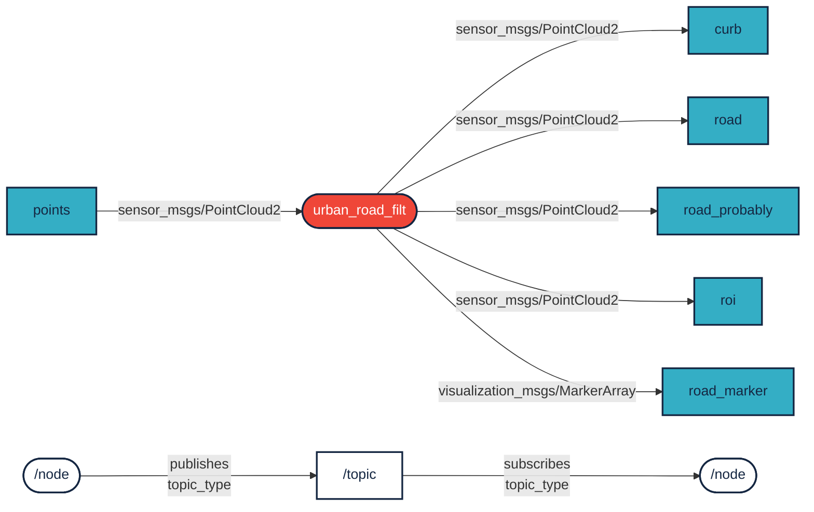

 

## `ROS 2` intro


`ROS 2`, the latest release of `ROS`, is a set of software libraries and tools (middleware) that help develop robot applications. By definition, middleware is software that connects software components. It is a layer that sits between the operating system and applications on both sides of a distributed computer network. `ROS 2` uses the permissive open source [Apache 2.0](https://choosealicense.com/licenses/apache-2.0/) license.




`ROS` has undergone incremental updates since its release in 2007, so there have been no fundamental changes, but major improvements have been made continuously. In 2017, the robotics community realized that the original 2007 concept has fundamental limitations that unfortunately cannot be improved in such an incremental way. Thus, in the end, Noetic Ninjemys (supported until 2025) is the last release of `ROS 1`, instead `ROS 2` started to be developed in parallel. This also means that it is more difficult to port the previous source codes to the new version, in return we can get a lot of new features, improvements, and support for the robots and vehicles to be developed.


As a result of the above, `ROS 2` moved from the world of academic research to industrial use. It is interesting that NASA's VIPER lunar rover also runs `ROS 2`. It is also used by automotive giants such as Bosch, BMW and Volvo. Many other examples could be given from robotics companies. Links: [www.nasa.gov/viper/lunar-operations](https://www.nasa.gov/viper/lunar-operations), [rosindustrial.org/ric/current-members](https://rosindustrial .org/ric/current-members/), [www.bosch.com/stories/bringing-robotics-middleware-onto-tiny-microcontrollers](https://www.bosch.com/stories/bringing-robotics-middleware -onto-tiny-microcontrollers/). ROS users in the world: [metrorobots.com/rosmap.html](http://metrorobots.com/rosmap.html).


Kép forrása: [Robot Operating System 2: Design, Architecture, and Uses In The Wild:
Steve Macenski et al.](https://arxiv.org/pdf/2211.07752.pdf)

## Why should I use a framework for my robotics project?

For our first robotics project, we can choose the path of creating our own solution without a framework. Obviously, this also has advantages (learning, running speed, etc.). But soon we will need an algorithm that has been implemented by others, but is not compatible with the original idea. Here it is advisable to consider using a framework (e.g. `ROS 2`). *Note* that `ROS 2` is not the only option, there are many similar, smaller frameworks: <a class="http" href="http://playerstage.sf.net">Player</a>, <a class="http" href="http://eris.liralab.it/yarp/">YARP</a>, <a class="http" href="http://www.orocos.org/"> Orocos</a>, <a class="http" href="http://carmen.sourceforge.net">CARMEN</a>, <a class="http" href="http://orca-robotics .sourceforge.net">Orca</a>, <a class="http" href="http://www.robots.ox.ac.uk/~pnewman/TheMOOS/index.html">MOOS</a >, and <a class="http" href="http://msdn.microsoft.com/en-us/robotics/default.aspx">Microsoft Robotics Studio</a>. Obviously, all of them have advantages, but in this case, due to the support, we narrow it down to `ROS 2`.


Image source: [ros.org/blog/ecosystem](https://www.ros.org/blog/ecosystem/)

- **Plumbing**: ROS basically provides a messaging system, often called "middleware" or "plumbing". Communication is one of the first needs that arise when implementing a new robotics application or any software system that is connected to hardware. The built-in and well-tested messaging system of ROS can save time, since it handles the details of communication between decentralized nodes, it does not need to be implemented separately. It is even possible to directly access memory on a machine using intra-process communication.
- **Tools**: Developing effective applications requires good development tools. ROS has such tools including: debugging (`rqt_console`), visualization (`Rviz2`, `Foxglove Studio`), plotting (`rqt_plot`, `Foxglove Studio`), logging (`mcap`) and replay.
- **Capabilities**: Whether it's a GPS device driver, a gait and balance controller for a quadruped robot, or a mapping system for a mobile robot, ROS has solutions to the problem. From drivers to algorithms to user interfaces, ROS provides the building blocks that allow you to focus on your application.
- **Community**: Behind ROS is a large, global and diverse community. From students and hobbyists to multinational companies and government agencies, all segments of people and organizations operate the `ROS 2` project. This is also important because a lot of questions will arise during development. Most of these have already been answered by the community, and they are usually happy to answer new questions.

The following figure shows the nodes (programs) and topics (~communication) of a simple line-following robot:



Source: [Bestmann, Marc & Fakultät, Min & Zhang, Jianwei & Hendrich, N.. (2017). Towards Using ROS in the RoboCup Humanoid Soccer League. Masterthesis](https://www.researchgate.net/publication/337707327_Towards_Using_ROS_in_the_RoboCup_Humanoid_Soccer_League)


Let's look at another example that creates maps from speed data, IMU, and distance data.




## `ROS 2` directory structure


``` bash
~/ros2_ws$ ls

build  install  log  src
```





``` bash
~/ros2_ws/
├──build  
├──install  
├──log
└──src/
    ├── bundle_packages 
    │   ├── cone_detection_lidar
    │   │   ├── launch
    │   │   └── src
    │   ├── my_vehicle_bringup
    │   │   └── launch
    │   ├── other bundle package1
    │   ├── other bundle package2
    │   └── img
    └── wayp_plan_tools
        ├── csv
        ├── launch
        └── src
```

## Differences between `ROS 1` and `ROS 2`

- *Changes in Middleware*
 `ROS 1` uses Master-Slave architecture and XML-RPC middleware. `ROS 2`, on the other hand, uses Data Distribution Service (DDS), which provides higher efficiency and reliability, low latency and scalability, as well as configurable quality of service (QoS) parameters. Among other things, you don't have to start `roscore' this way. XML-RPC is better for simple remote procedure calls, while the added complexity of DDS allows it to better support real-time systems.
- *Changes in ROS API*
 `ROS 1` has two separate libraries: `roscpp` for C++ and `rospy` for Python. They are not exactly identical to each other in terms of functions. In contrast, `ROS 2` has a base library written in C - `rcl` (ROS client library) - on which libraries are built. This ensures that core functionality is available sooner in various APIs. This is one of the main reasons why `ROS 2` is able to provide more language support besides the previous Python and C++: for example [rclada](https://github.com/ada-ros/rclada) Ada, [rclcpp](https://github.com/ros2/rclcpp) C++, [rclgo](https://github.com/juaruipav/rclgo) Go, [rclpy](https://github.com/ros2/ rclpy) Python, [rcljava](https://github.com/esteve/ros2_java/tree/master/rcljava) Java, [rclnodejs](https://github.com/RobotWebTools/rclnodejs) Node.js, [rclobjc ](https://github.com/esteve/ros2_objc) Objective C (iOS), [rclc](https://github.com/ros2/rclc) C, [ros2_rust](https://github.com/ ros2-rust/ros2_rust) Rust, [ros2_dotnet](https://github.com/esteve/ros2_dotnet) .NET, [ros2cs](https://github.com/RobotecAI/ros2cs) ros2_dotnet alternative in C#.

- *Changes in data format*
 `ROS 2` uses the `MCAP` format, which is not a dedicated ROS proprietary format, but an open source container file format for multimodal log data. It supports time-stamped pre-queued data and is ideal for use in pub/sub or robotics applications. More: [mcap.dev](https://mcap.dev/)


### A couple of useful updates
- *Real-time processing*
 The summary of the above functions, as well as the use of DDS, make `ROS 2' well suited for real-time processing, especially when deterministic, low-latency communication is required.
- *QoS: Quality of Service*
 `ROS 2` allows you to configure data flow, which affects how data is sent and received. This includes message reliability, deadline, and priority settings that can ensure critical messages are delivered on time.
- *Multi-threaded execution*
 `ROS 2` supports truly parallel running of multiple nodes, so modern multi-core processors can be used much better than `ROS 1`.


Source: [husarnet.com/blog/ros2-docker](https://husarnet.com/blog/ros2-docker)


### Other changes
- Catkin is gone, replaced by Ament (Colcon) as build system. Overlays allow you to create a secondary workspace that does not affect the primary workspace - this is useful when you need to experiment with new packages, but without affecting the base configuration (called an "underlay").
- `ROS 2` is not backwards compatible with `ROS 1`. Consequently, `ROS 1` packages will probably not work with `ROS 2` and would require reworking, and other software you used to use with `ROS 1` will no longer work.
- `ROS 1` is mainly made for Ubuntu. `ROS 2` runs on MacOS, Windows, Ubuntu and other (even Real-Time) operating systems.

### Versions


Percentage distribution of distros over time: [metrics.ros.org/rosdistro_rosdistro.html](https://metrics.ros.org/rosdistro_rosdistro.html)

[](https://docs.ros.org/en/humble/)

`Humble Hawksbill` or `Humble` for short is a long term support (LTS) release, supported for 5 years (May 2022 to May 2027)

Additional releases: [docs.ros.org/en/humble/Releases.html](https://docs.ros.org/en/humble/Releases.html)


## Concepts

### Nodes

In the simplest terms, node means a ROS program (in other words, node). In the figure, it is marked with a round 🔴 symbol. Their characteristics:

- "Executables" (c++ / py).
- Each node is a "program", a separated process. Small overhead can be achieved >> intra-process communication.
- ROS manages the threads (threading).
- There can be several threads inside a node.
- publish/subscribe topics.
- Several nodes can "publish" on a topic, and one node can "listen" to several topics.

### Topics

Topics can be understood as a named "port" where nodes can communicate. In the figure, it is marked with a square symbol 🟦. Their characteristics:

- Responsible for information flow between nodes.
- The type of each topic is determined by the "message".
- "many-to-many" communication between nodes is allowed

### Messages

- The content and structure of a topic is determined by the message
- Application programming interface (API) for Nodes are defined in files with .msg extension

#### Types of messages
- Primitive built-in types (std_msgs)
  - `bool`, `string`, `float32`, `int32`, `…`
- Higher-level built in types:
  - `geometry_msgs`: `Point`, `Polygon`, `Vector`, `Pose`, `PoseWithCovariance`, `…`
  - `nav_msgs`: `OccupancyGrid`, `Odometry`, `Path`, `…`
  - `sensors_msgs`: `Joy`, `Imu`, `NavSatFix`, `PointCloud`, `LaserScan`, …
- Támogatottak továbbá:
  - Konstansok
  - Felsorolások
  - Beágyazott definíciók

Példa:

``` bash
$ ros2 interface show geometry_msgs/msg/Point
float64 x
float64 y
float64 z
```

``` bash
$ ros2 interface show std_msgs/msg/Header
uint32 seq
time stamp
string frame_id
```

A `Header` és a`Point` a típusból épül fel a `PoseStamped` típus struktúrája:

``` bash
$ ros2 interface show geometry_msgs/msg/PoseStamped
std_msgs/Header header
  uint32 seq
  time stamp
  string frame_id
geometry_msgs/Pose pose
  geometry_msgs/Point position
    float64 x
    float64 y
    float64 z
  geometry_msgs/Quaternion orientation
    float64 x
    float64 y
    float64 z
    float64 w
```

### Publishing / Subscribing

In the following, the node named `urban_road_filt` subscribes to `points` data, which is of type `PointCloud2`, and advertises messages of type `PointCloud2`, `MarkerArray`:



### Parameters

- Not everything can be written using Publish/Subscribe
- Nodes may sometimes need parameterization
- Parameters can be:
    - Controller type
    - Color thresholds;
    - Camera resolution, etc

### Launch files

Batch execution of several nodes (ROS program). Keeping the `ROS 1` conventions, it can be an XML format file that can define almost all aspects/operations of ROS. More recently, however, these can also be `python` files, so we have much more freedom. Start Node, set / load parameters, map topic, pass command line arguments.

## Code example

=== "Python"

    ``` py linenums="1"
    #  ros2 topic type /lexus3/gps/duro/current_pose
    #  geometry_msgs/msg/PoseStamped
    #  ros2 interface show geometry_msgs/msg/PoseStamped

    import rclpy
    from rclpy.node import Node
    from geometry_msgs.msg import PoseStamped


    class SimplePoseSub(Node):

        def __init__(self):
            super().__init__('simple_pose_sub')
            self.sub1_ = self.create_subscription(PoseStamped, '/lexus3/gps/duro/current_pose', self.topic_callback, 10)


        def topic_callback(self, msg):

            self.get_logger().info('x: %.3f, y: %.3f', msg.pose.position.x, msg.pose.position.y)


    def main(args=None):

        rclpy.init(args=args)                   ## Initialize the ROS 2 client library
        simple_pose_sub = SimplePoseSub()
        rclpy.spin(simple_pose_sub)             ## Create a node and spin
        simple_pose_sub.destroy_node()
        rclpy.shutdown()                        ## Shutdown the ROS 2 client library

    if __name__ == '__main__':
        main()
    ```

=== "C++" 

    ``` c++ linenums="1"
    // ros2 topic type /lexus3/gps/duro/current_pose
    // geometry_msgs/msg/PoseStamped
    // ros2 interface show geometry_msgs/msg/PoseStamped

    #include "rclcpp/rclcpp.hpp"
    #include <memory>
    #include "geometry_msgs/msg/pose_stamped.hpp"
    using std::placeholders::_1;

    class SimplePoseSub : public rclcpp::Node{
    public:
        SimplePoseSub() : Node("simple_pose_sub")
        {
            sub1_ = this->create_subscription<geometry_msgs::msg::PoseStamped>("/lexus3/gps/duro/current_pose", 10, std::bind(&SimplePoseSub::topic_callback, this, _1));
        }

    private:
        void topic_callback(const geometry_msgs::msg::PoseStamped &msg) const
        {
            RCLCPP_INFO(this->get_logger(), "x: %.3f, y: %.3f", msg.pose.position.x, msg.pose.position.y);
        }
        rclcpp::Subscription<geometry_msgs::msg::PoseStamped>::SharedPtr sub1_;
        };

    int main(int argc, char *argv[])
    {
        rclcpp::init(argc, argv);               // Initialize the ROS 2 client library
        rclcpp::spin(
            std::make_shared<SimplePoseSub>()); // Create a node and spin

        rclcpp::shutdown();                     // Shutdown the ROS 2 client library
        return 0;

    }
    ```


## Sources
- [docs.ros.org/en/humble](https://docs.ros.org/en/humble/)
- [ros.org/blog/ecosystem](https://www.ros.org/blog/ecosystem/)
- [husarnet.com/blog/ros2-docker](https://husarnet.com/blog/ros2-docker)
- [design.ros2.org/articles/intraprocess_communications.html](https://design.ros2.org/articles/intraprocess_communications.html)
- [Towards Using ROS in the RoboCup Humanoid Soccer League - Masterthesis](https://www.researchgate.net/publication/337707327_Towards_Using_ROS_in_the_RoboCup_Humanoid_Soccer_League)

