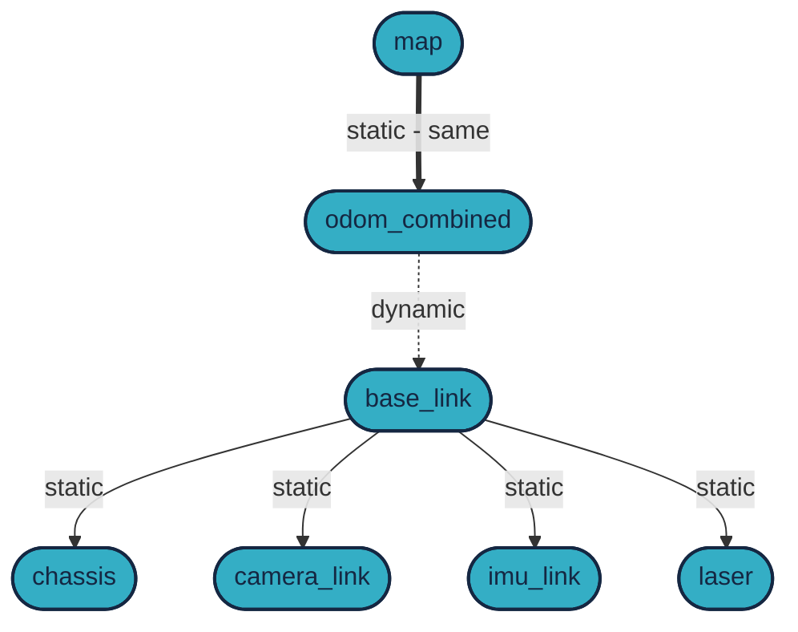

# Wheeltec `101`

- **Robot**: Wheeltec Roboworks Ackermann Mini
- **ROS version**: ROS 2 Jazzy *(but also works with ROS 2 Humble)*


[](https://docs.ros.org/en/humble/) 
[](https://docs.ros.org/en/jazzy/)


The short link to this page: [go.sze.hu/wh](https://go.sze.hu/wh)

## `1.` Basic usage

### Robot connection

|property | default |
|---|---|
|`user@hostname` | `wheeltec@roboworks` <br />`wheeltec@192.168.0.1##` |
|SSID | `wheeltec_robo_##` |
|Password | `dongguan` |

### Battery status

|status | volt |
|---|---|
|🟢 | 21.0 `V`- 25.0`V` |
|🟡 | 20.0`V`- 21.0`V` |
|🔴 | > 20.0 `V` |


### `nmtui` / WiFi hotspot 

Network Manager Text User Interface

```yaml
Profile name: hotspot1
Device: wlan0
SSID: wheeltec_robo_#
Mode: Access Point
Security: WPA & WPA2 Personal
Password: dongguan
IPv4 address: from 192.168.0.101/24 to 192.168.0.113/24 
IPv4 gateway: 192.168.0.1
```


### VS code SSH

If your robot IP is `192.168.0.101` then:

```powershell
PS C:\Users\he> ssh wheeltec@192.168.0.100 mkdir -p .ssh
wheeltec@192.168.0.100's password:

PS C:\Users\he> cat .ssh/id_rsa.pub | ssh wheeltec@192.168.0.100 'cat >> .ssh/authorized_keys'
wheeltec@192.168.0.100's password:

PS C:\Users\he> ssh wheeltec@192.168.0.100

PS C:\Users\he\.ssh> ls
known_hosts
```

## `2.` Using `ROS 2` for driver and controller

### Driver

The defualt command is to start the robot with the `ROS 2` launch file, which blocks the terminal.

<details>
<summary>Don't forget to source before ROS commands.</summary>

```bash
source ~/ros2_ws/install/setup.bash
```
```bash
r2
```
</details>

```bash
ros2 launch turn_on_wheeltec_robot turn_on_wheeltec_robot.launch.py lidar:=true camera:=true foxglove:=true joy:=false
```

The preferred way is to use the provided script [`start_drivers`](https://github.com/robotverseny/drivers/blob/main/shell/start_drivers.sh), which starts the robot drivers in the background (witht the help of [`screen`](https://github.com/szenergy/szenergy-public-resources/wiki/H-cheatsheet#screen)).

```bash
start_drivers
```

Observe similar output:


Also you can stop the drivers with the provided script [`stop_all`](https://github.com/robotverseny/drivers/blob/main/shell/stop_all.sh).

```bash
stop_all
```

### Controller

The defualt command is to start the controller with the `ROS 2` launch file, which blocks the terminal.


<details>
<summary>Don't forget to source before ROS commands.</summary>

```bash
source ~/ros2_ws/install/setup.bash
```
```bash
r2
```
</details>

```bash
ros2 launch megoldas_sim24 megoldas1.launch.py # start simple_pursuit
```
```bash
ros2 run megoldas_sim24 simple_pursuit.py
```
```bash
ros2 launch megoldas_sim24 megoldas2.launch.py # start follow_the_gap
```
```bash
ros2 run megoldas_sim24 follow_the_gap.py
```

- [simple_pursuit](https://github.com/robotverseny/megoldas_sim24/blob/main/megoldas_sim24/simple_pursuit.py)
- [follow_the_gap](https://github.com/robotverseny/megoldas_sim24/blob/main/megoldas_sim24/follow_the_gap.py)
- [megoldas1.launch.py](https://github.com/robotverseny/megoldas_sim24/blob/main/launch/megoldas1.launch.py)
- [megoldas2.launch.py](https://github.com/robotverseny/megoldas_sim24/blob/main/launch/megoldas2.launch.py)


## `3.` Data acquisition

Use the provided launch file to start data acquisition:

```bash
ros2 launch mcap_rec preset_wheeltec01.launch.py tag:=scenario01
```

In this way the data will be stored in the `/home/wheeltec/bag/` folder with the in filename `scenario01` is the tag you provided. This way it is easier to identify the different data acquisition sessions.

Copy the data to your local computer with `rsync`. On your **local** computer run:


```bash
rsync -avzh --progress wheeltec@192.168.0.100:/home/wheeltec/bag/my_record1 /mnt/c/bag/
```

!!! Warning

    You can only run the `rsync` command on your local computer, not on Wheeltec robot!


## `4.` Visualization 

### Foxglove studio

If you have started the robot driver with the `foxglove:=true` argument, then you can connect to the robot with Foxglove studio.


The frame `/odom_combined` is practically the same as `/map`, there is a static `0,0,0` transform between them. The only dynamic transform is between `/odom_combined` and `/base_link`.



!!! danger

    There might be even more frames, but we are not using them.

## `5.` Code editing in VS code

The recommended way to edit code on the robot is to use VS code with the `Remote - SSH` extension.


## `6.` Commands

| Command | Description |
|---|---|
|`start_drivers` | Start the robot drivers in the background |
|`stop_all` | Stop all background processes started with `screen` |
|`r2` | Source the ROS 2 workspace (same as `source ~/ros2_ws/install/setup.bash`) |
|`ros2 topic list` | List all active topics |
|`ros2 topic echo /topic_name` | Echo the messages of a topic |
|`ros2 topic hz /topic_name` | Show the publishing rate of a topic |
|`ros2 topic info /topic_name -v` | Show information about a topic |
|`ros2 node list` | List all active nodes |


## Useful links

- [go.sze.hu/wh](https://go.sze.hu/wh)
- [foxglove.dev](https://foxglove.dev/)
- [github.com/lichtblick-suite/lichtblick](https://github.com/lichtblick-suite/lichtblick)
- [github.com/robotverseny/fyi](https://github.com/robotverseny/fyi)
- [github.com/szenergy/szenergy-public-resources/wiki/H-SSH-no-password](https://github.com/szenergy/szenergy-public-resources/wiki/H-SSH-no-password)
- [github.com/robotverseny/jkk_utils/tree/mcap_rec/mcap_rec](https://github.com/robotverseny/jkk_utils/tree/mcap_rec/mcap_rec)
- [github.com/robotverseny/megoldas_sim24](https://github.com/robotverseny/megoldas_sim24)
- [jkk-research.github.io/workshops/f1tenth_sim_a](https://jkk-research.github.io/workshops/f1tenth_sim_a)